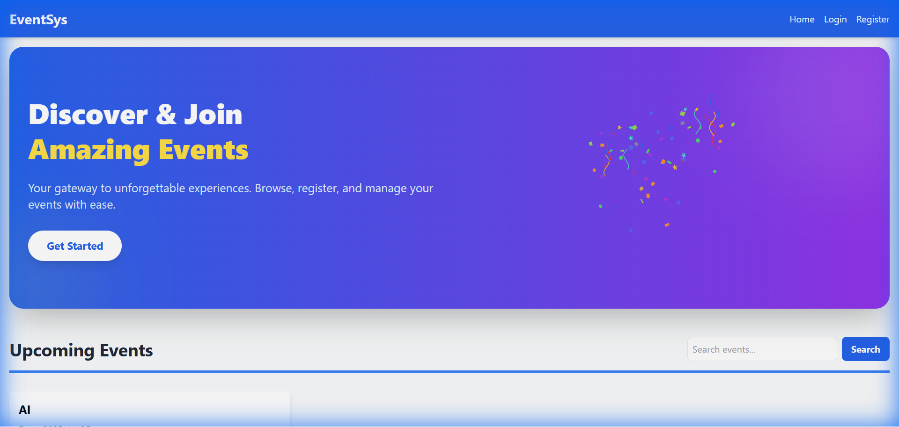
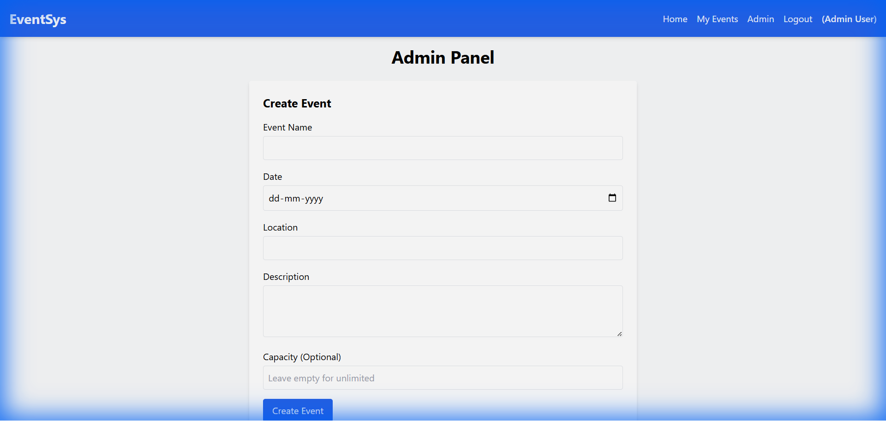

# RegiFlow - Event Registration System

A modern, full-stack Event Registration System built with React.js, Spring Boot, and MongoDB. Features include user authentication, event management, capacity control, search functionality, and beautiful Lottie animations.


## ✨ Features

### User Features
- 🔐 **User Authentication** - Secure registration and login with Spring Security
- 📅 **Browse Events** - View all available events with search functionality
- 🎫 **Event Registration** - Register for events with capacity tracking
- 📊 **My Events** - View all registered events in one place
- 🔍 **Search & Filter** - Search events by name or location
- 🎨 **Lottie Animations** - Beautiful animations for enhanced UX

### Admin Features
- ⚙️ **Event Management** - Create, update, and delete events
- 👥 **Capacity Control** - Set event capacity limits to prevent overbooking
- 📈 **Real-time Tracking** - See registration counts and availability
- 🎯 **Admin Panel** - Dedicated interface for event administration

### Technical Features
- 🔒 **Role-Based Access Control** - Separate user and admin permissions
- 🌐 **RESTful API** - Clean API architecture
- 💾 **MongoDB Integration** - NoSQL database for flexible data storage
- 🎭 **Responsive Design** - Mobile-first UI with TailwindCSS
- ✅ **Data Validation** - Backend and frontend validation
- 🚀 **Auto-Seeding** - Default admin user created on startup

## 🛠️ Tech Stack

### Frontend
- **React.js** - UI library
- **TailwindCSS** - Utility-first CSS framework
- **React Router** - Client-side routing
- **Axios** - HTTP client
- **Lottie React** - Animation library

### Backend
- **Spring Boot** - Java framework
- **Spring Security** - Authentication & authorization
- **Spring Data MongoDB** - Database integration
- **Lombok** - Reduce boilerplate code
- **BCrypt** - Password encryption

### Database
- **MongoDB** - NoSQL database

## 📋 Prerequisites

Before you begin, ensure you have the following installed:
- **Java 17+** - [Download](https://www.oracle.com/java/technologies/downloads/)
- **Node.js 18+** - [Download](https://nodejs.org/)
- **MongoDB** - [Download](https://www.mongodb.com/try/download/community)
- **Git** - [Download](https://git-scm.com/downloads)

## 🚀 Installation & Setup

### 1. Clone the Repository
```bash
git clone https://github.com/madhan-200/RegiFlow.git
cd RegiFlow
```

### 2. Database Setup
1. Start MongoDB service:
   ```bash
   # Windows
   net start MongoDB
   
   # macOS/Linux
   sudo systemctl start mongod
   ```
2. MongoDB will run on `localhost:27017`
3. Database `event_db` will be created automatically

### 3. Backend Setup
```bash
cd backend

# Windows
.\mvnw spring-boot:run

# macOS/Linux
./mvnw spring-boot:run
```
The backend server will start on `http://localhost:8080`

**Default Admin Credentials:**
- Email: `admin@example.com`
- Password: `admin123`

### 4. Frontend Setup
```bash
cd frontend

# Install dependencies
npm install

# Start development server
npm run dev
```
The frontend will be available at `http://localhost:5173`

## 🎯 Usage

### For Users
1. **Register** - Create a new account at `/register`
2. **Login** - Sign in with your credentials
3. **Browse Events** - View all available events on the home page
4. **Search Events** - Use the search bar to find events by name or location
5. **Register for Events** - Click on an event and hit "Register Now"
6. **View My Events** - Check your registered events at `/my-events`

### For Admins
1. **Login** - Use admin credentials (`admin@example.com` / `admin123`)
2. **Access Admin Panel** - Click "Admin" in the navbar
3. **Create Events** - Fill in event details including capacity
4. **Manage Events** - Edit or delete existing events
5. **Monitor Capacity** - See real-time registration counts

## 📁 Project Structure

```
RegiFlow/
├── backend/
│   ├── src/
│   │   ├── main/
│   │   │   ├── java/com/example/event/
│   │   │   │   ├── config/          # Security & Data initialization
│   │   │   │   ├── controller/      # REST controllers
│   │   │   │   ├── model/           # Entity models
│   │   │   │   ├── repository/      # MongoDB repositories
│   │   │   │   └── service/         # Business logic
│   │   │   └── resources/
│   │   │       └── application.properties
│   └── pom.xml
├── frontend/
│   ├── src/
│   │   ├── api/                     # Axios configuration
│   │   ├── components/              # Reusable components
│   │   ├── context/                 # Auth context
│   │   ├── pages/                   # Page components
│   │   ├── App.jsx
│   │   └── main.jsx
│   └── package.json
└── README.md
```

## 🔌 API Endpoints

### Authentication
- `POST /api/auth/register` - Register new user
- `GET /api/auth/login` - User login

### Events
- `GET /api/events` - Get all events
- `GET /api/events?search={keyword}` - Search events
- `GET /api/events/{id}` - Get event by ID
- `POST /api/events` - Create event (Admin only)
- `PUT /api/events/{id}` - Update event (Admin only)
- `DELETE /api/events/{id}` - Delete event (Admin only)

### Registrations
- `GET /api/registrations/my-events` - Get user's registered events
- `POST /api/registrations` - Register for event
- `DELETE /api/registrations/{eventId}` - Unregister from event

## 🎨 Screenshots

### Home Page
Beautiful hero section with Lottie animations, event listings, and search functionality.



### Admin Panel
Comprehensive event management interface with CRUD operations and capacity control.



## 🔐 Security

- **Password Encryption** - BCrypt hashing
- **HTTP Basic Authentication** - Secure API endpoints
- **Role-Based Access** - User and Admin roles
- **CORS Configuration** - Controlled cross-origin requests
- **Input Validation** - Server-side validation

## 🌟 Key Features Explained

### Event Capacity Management
- Admins can set capacity limits when creating events
- System prevents overbooking by checking available spots
- Real-time availability display on event cards
- "Sold Out" badge when capacity is reached

### Search & Filter
- Search events by name or location
- Case-insensitive search
- Real-time results
- Clean, intuitive UI

### Lottie Animations
- Hero section animation on home page
- Authentication page animations
- Success animation on registration
- Empty state animation for "My Events"

## 🤝 Contributing

Contributions are welcome! Please feel free to submit a Pull Request.

## 📝 License

This project is open source and available under the [MIT License](LICENSE).

## 👨‍💻 Author

**Madhan**
- GitHub: [@madhan-200](https://github.com/madhan-200)

## 🙏 Acknowledgments

- Lottie animations from [LottieFiles](https://lottiefiles.com/)
- Icons and design inspiration from modern web applications
- Spring Boot and React communities for excellent documentation

---

**Made with ❤️ using React, Spring Boot, and MongoDB**
